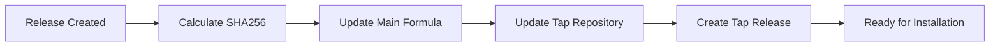

# 🤖 Homebrew Automation Setup Guide

This guide explains how to set up automatic Homebrew package updates whenever a new release is created.

## 🚀 **What the Automation Does**

When you create a GitHub release, the automation will:

1. ✅ **Calculate SHA256** hash for the new release tarball
2. ✅ **Update Formula** in the main repository 
3. ✅ **Update Homebrew Tap** repository automatically
4. ✅ **Create Tap Release** with installation instructions
5. ✅ **Validate Everything** to ensure it works

## 🔧 **Setup Instructions**

### Step 1: Create Personal Access Token

The automation needs permission to update the `homebrew-codecompass` repository.

1. **Go to GitHub Settings:**
   - Visit: https://github.com/settings/tokens
   - Click "Generate new token (classic)"

2. **Configure Token:**
   - **Note**: `CodeCompass Homebrew Automation`
   - **Expiration**: Choose appropriate duration (1 year recommended)
   - **Scopes** (select these):
     - ✅ `repo` (Full control of private repositories)
     - ✅ `workflow` (Update GitHub Action workflows)
     - ✅ `write:packages` (Upload packages to GitHub Package Registry)

3. **Copy the Token** (you won't see it again!)

### Step 2: Add Secret to Repository

1. **Go to Repository Settings:**
   - Visit: https://github.com/xeon-zolt/codecompass/settings/secrets/actions
   - Click "New repository secret"

2. **Add Secret:**
   - **Name**: `HOMEBREW_TAP_TOKEN`
   - **Value**: Paste the token you copied
   - Click "Add secret"

### Step 3: Verify Automation Setup

The automation is already configured in `.github/workflows/homebrew-release.yml`

## 🧪 **Testing the Automation**

### Option 1: Create a Test Release
```bash
# Create a test release
git tag -a v1.0.1-test -m "Test release for automation"
git push origin v1.0.1-test

# Create release on GitHub
gh release create v1.0.1-test --title "Test Release v1.0.1" --notes "Testing automation"
```

### Option 2: Manual Trigger
```bash
# Trigger workflow manually
gh workflow run homebrew-release.yml -f version=v1.0.1-test
```

## 📋 **What Happens During Automation**

### 1. **Trigger Events**
- ✅ New GitHub release is published
- ✅ Manual workflow dispatch

### 2. **Automatic Steps**


### 3. **Files Updated**
- `Formula/codecompass.rb` (main repository)
- `Formula/codecompass.rb` (tap repository)
- Release notes in tap repository

## 🔒 **Security Considerations**

### Token Permissions
The `HOMEBREW_TAP_TOKEN` has access to:
- ✅ Update the `homebrew-codecompass` repository
- ✅ Create releases in the tap repository
- ❌ NO access to other repositories
- ❌ NO admin permissions

### Fallback Security
If `HOMEBREW_TAP_TOKEN` is not available, the workflow will:
- Use `GITHUB_TOKEN` (limited permissions)
- Skip cross-repository updates
- Still update the main repository formula

## 📊 **Monitoring Automation**

### Check Workflow Status
```bash
# View recent workflow runs
gh run list --workflow=homebrew-release.yml

# View specific run details
gh run view <run-id>
```

### Verify Tap Updates
```bash
# Check if tap is updated
brew tap xeon-zolt/codecompass
brew info codecompass

# Should show the latest version
```

## 🛠️ **Troubleshooting**

### Common Issues

**1. Token Expired**
- **Error**: `Authentication failed`
- **Solution**: Generate new token and update secret

**2. Permission Denied**
- **Error**: `Permission denied (publickey)`
- **Solution**: Ensure token has correct scopes

**3. Formula Validation Failed**
- **Error**: `Ruby syntax error`
- **Solution**: Check formula syntax in main repository

### Debug Steps

**1. Check Workflow Logs**
```bash
gh run view --log
```

**2. Validate Token Permissions**
```bash
# Test token access
curl -H "Authorization: token $HOMEBREW_TAP_TOKEN" \
     https://api.github.com/repos/xeon-zolt/homebrew-codecompass
```

**3. Manual Formula Update**
```bash
# Update tap repository manually
git clone https://github.com/xeon-zolt/homebrew-codecompass.git
cd homebrew-codecompass
# ... make updates ...
git push
```

## 🎯 **Automation Workflow Details**

### Workflow File: `.github/workflows/homebrew-release.yml`

**Triggers:**
- `release.types: [published]`
- `workflow_dispatch` (manual)

**Permissions:**
- `contents: write`
- `pull-requests: write`

**Environment:**
- `ubuntu-latest`
- Uses `HOMEBREW_TAP_TOKEN` or falls back to `GITHUB_TOKEN`

**Key Steps:**
1. **Checkout Repositories**: Both main and tap repos
2. **Calculate SHA256**: For release tarball
3. **Update Formulas**: Both repositories with correct hash
4. **Create Release**: In tap repository with installation instructions
5. **Validate**: Ensure everything works correctly

## 🎉 **Benefits of Automation**

### For Maintainers
- ⚡ **Zero Manual Work** - Releases update Homebrew automatically
- 🔒 **Consistent Process** - Same steps every time
- ✅ **Error Prevention** - Automated validation
- 📝 **Documentation** - Auto-generated release notes

### For Users  
- 🚀 **Faster Updates** - New versions available immediately
- 📦 **Reliable Installation** - Automated testing ensures it works
- 📋 **Clear Instructions** - Release notes include installation steps

## 📝 **Usage After Setup**

Once automation is set up, releasing is simple:

```bash
# 1. Create and push tag
git tag -a v1.1.0 -m "Release v1.1.0 - New awesome features"
git push origin v1.1.0

# 2. Create GitHub release
gh release create v1.1.0 \
  --title "🧭 CodeCompass v1.1.0" \
  --notes "New features and improvements"

# 3. That's it! 🎉
# Automation handles:
# - Homebrew formula updates
# - Tap repository updates  
# - Release creation
# - User notifications
```

Users can then install with:
```bash
brew tap xeon-zolt/codecompass
brew install codecompass
```

---

🤖 **Automated Homebrew Updates - Set It and Forget It!**