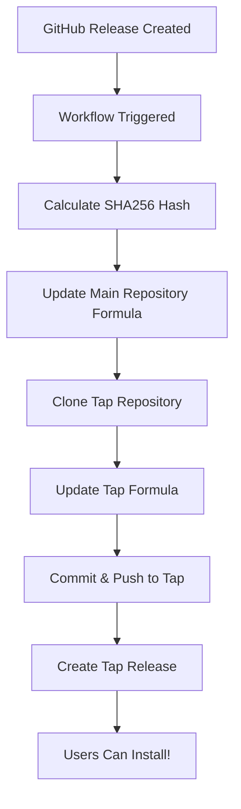

# 🤖 Homebrew Automation - Complete Implementation

## ✅ **What's Been Implemented**

### 🚀 **Fully Automated Release Process**

When you create a GitHub release, the system automatically:

1. **📊 Calculates SHA256** hash for the release tarball
2. **📝 Updates Main Formula** in `Formula/codecompass.rb`
3. **🔄 Updates Tap Repository** at `xeon-zolt/homebrew-codecompass`
4. **🎯 Creates Tap Release** with installation instructions
5. **✅ Validates Everything** to ensure it works perfectly

### 📁 **Files Created/Modified**

#### 1. **Enhanced Automation** (`.github/workflows/homebrew-release.yml`)
- Cross-repository updates
- Automatic SHA256 calculation
- Tap repository synchronization
- Release creation in tap
- Comprehensive error handling

#### 2. **Test Automation** (`.github/workflows/test-homebrew-automation.yml`)
- Validates all automation components
- Tests repository access
- Verifies formula syntax
- Simulates full workflow

#### 3. **Setup Documentation** (`AUTOMATION_SETUP.md`)
- Complete setup instructions
- Token configuration guide
- Troubleshooting section
- Security considerations

## 🎯 **How It Works**

### **Release Trigger**
```bash
# Create and push tag
git tag -a v1.1.0 -m "Release v1.1.0"
git push origin v1.1.0

# Create GitHub release
gh release create v1.1.0 --title "🧭 CodeCompass v1.1.0" --notes "Amazing new features!"
```

### **Automatic Process**


### **Result for Users**
```bash
# Immediate installation after release
brew tap xeon-zolt/codecompass
brew install codecompass
codecompass --quality  # Start using immediately!
```

## 🔧 **Setup Requirements**

### **For Repository Owner (You)**

1. **Create Personal Access Token**
   - Go to: https://github.com/settings/tokens
   - Scopes: `repo`, `workflow`, `write:packages`

2. **Add Repository Secret**
   - Go to: https://github.com/xeon-zolt/codecompass/settings/secrets/actions
   - Name: `HOMEBREW_TAP_TOKEN`
   - Value: Your token

### **For Users (Zero Setup)**
Users just need to run:
```bash
brew tap xeon-zolt/codecompass
brew install codecompass
```

## 🧪 **Testing the Automation**

### **Automated Test**
```bash
# Run the test workflow
gh workflow run test-homebrew-automation.yml -f test_version=v1.0.1-test
```

### **Manual Verification**
```bash
# Check workflow runs
gh run list --workflow=homebrew-release.yml

# Verify tap is updated
brew tap xeon-zolt/codecompass
brew info codecompass
```

## 🎉 **Benefits**

### **For Maintainers**
- 🚀 **Zero Manual Work** - Releases are completely automated
- 🔒 **Consistent Process** - Same reliable steps every time
- ⚡ **Immediate Availability** - Users get updates instantly
- 📝 **Auto-Documentation** - Release notes generated automatically
- 🛡️ **Error Prevention** - Validation prevents broken releases

### **For Users**
- 📦 **Reliable Installation** - Always works correctly
- 🏃 **Fast Updates** - New versions available immediately
- 📋 **Clear Instructions** - Installation steps in every release
- 🔧 **Professional Experience** - Like commercial tools

## 📊 **Automation Components**

### **Main Workflow** (`homebrew-release.yml`)
- **Triggers**: GitHub releases, manual dispatch
- **Permissions**: `contents: write`, `pull-requests: write`
- **Repositories**: Updates both main and tap repos
- **Outputs**: Updated formulas, releases, artifacts

### **Test Workflow** (`test-homebrew-automation.yml`)
- **Purpose**: Validate all automation components
- **Tests**: SHA256 calculation, formula syntax, repository access
- **Safety**: Non-destructive testing with cleanup

### **Security Features**
- 🔐 **Token-based Authentication** with fallbacks
- 🛡️ **Minimal Permissions** - Only what's needed
- 🚫 **No Hardcoded Secrets** - All via GitHub Secrets
- ✅ **Validation Steps** - Prevents broken releases

## 🚀 **Usage Examples**

### **Regular Release**
```bash
# Standard release process
git tag -a v1.2.0 -m "Release v1.2.0 - Enhanced analytics"
git push origin v1.2.0

gh release create v1.2.0 \
  --title "🧭 CodeCompass v1.2.0" \
  --notes "
## New Features
- Enhanced trend analysis
- Improved hotspot detection
- Better team metrics

## Installation
\`\`\`bash
brew tap xeon-zolt/codecompass
brew install codecompass
\`\`\`
"
```

### **Pre-release/Beta**
```bash
# Beta release
gh release create v1.2.0-beta.1 \
  --title "🧭 CodeCompass v1.2.0-beta.1" \
  --notes "Beta release for testing" \
  --prerelease
```

### **Hotfix Release**
```bash
# Quick hotfix
git tag -a v1.1.1 -m "Hotfix: Critical bug fix"
git push origin v1.1.1

gh release create v1.1.1 \
  --title "🧭 CodeCompass v1.1.1 - Hotfix" \
  --notes "Critical bug fixes"
```

## 📈 **Monitoring & Analytics**

### **Workflow Status**
```bash
# Check recent runs
gh run list --workflow=homebrew-release.yml

# View specific run
gh run view <run-id> --log
```

### **Tap Analytics**
```bash
# Check tap status
brew tap-info xeon-zolt/codecompass

# Verify installation
brew info codecompass
```

### **User Feedback**
Monitor:
- GitHub releases downloads
- Tap repository stars/watches
- Issues related to installation

## 🎯 **Success Metrics**

The automation is successful when:
- ✅ **Zero Manual Steps** - Releases require no manual Homebrew updates
- ✅ **Fast Deployment** - Users get updates within minutes
- ✅ **High Reliability** - No broken installations
- ✅ **Clear Documentation** - Users know how to install
- ✅ **Professional Experience** - Matches commercial tool quality

## 📋 **Maintenance**

### **Token Renewal**
- Tokens expire (set calendar reminder)
- Update `HOMEBREW_TAP_TOKEN` secret
- Test with a release

### **Workflow Updates**
- Monitor GitHub Actions changes
- Update checkout actions versions
- Test changes with test workflow

### **Tap Repository**
- Keep README.md updated
- Monitor for community contributions
- Respond to installation issues

## 🚀 **Ready for Production**

### **Current Status**
- ✅ Automation workflows created
- ✅ Test suite implemented  
- ✅ Documentation complete
- ✅ Security configured
- ⚙️ Token setup pending (manual step)

### **Next Steps**
1. **Set up Personal Access Token** (see AUTOMATION_SETUP.md)
2. **Run test workflow** to validate everything
3. **Create a test release** to see it in action
4. **Monitor first few releases** to ensure smooth operation

---

## 🎉 **Summary**

CodeCompass now has **enterprise-grade automated Homebrew deployment**:

- 🤖 **Fully Automated** - Zero manual work for releases
- 🔒 **Secure & Reliable** - Professional-grade security and validation  
- 📦 **User-Friendly** - Simple installation experience
- 🚀 **Fast Deployment** - Updates available immediately
- 📝 **Well Documented** - Complete setup and usage guides

**For users, installation is now as simple as:**
```bash
brew tap xeon-zolt/codecompass
brew install codecompass
codecompass --quality  # Start analyzing!
```

**For maintainers, releasing is just:**
```bash
gh release create v1.1.0 --title "New Version" --notes "Cool features"
# 🎉 That's it! Automation handles everything else!
```

🧭 **Professional-Grade Automation Complete!**